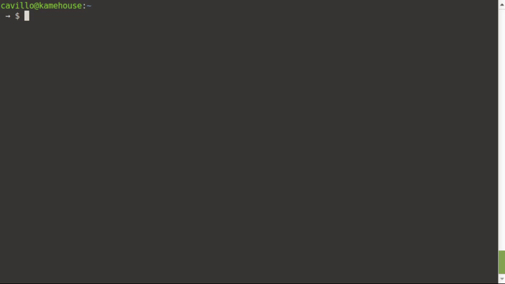

# polymetis-node

[](http://cloud.drone.io/cavillo/polymetis-node)

Polymetis is a tool that provides a light, scalable and customizable base for developing distributed and loosely coupled microservices.

## Features
  - Loosely Coupled
  - Event Driven
  - Scalable
  - REST API
  - RPC's
  - Extendable Interfaces
  - Standardized configuration and logging

# Installation

Install the npm package
```bash
$ npm install polymetis-node --save
```

Create a microservice template
```bash
$ npx polymetis-node my-service
$ cd my-service
$ npm start
```



### Requirements
RabbitMQ is required to allow the service to send and receive messages.
In case you dont have a RabbitMQ, you can use docker-compose. (Do not use this in production).
Create a `docker-compose.yml` file and copy the following:

```yml
version: '2'
services:
  rabbitmq:
    image: 'rabbitmq:3.7-management-alpine'
    ports:
      - '15672:15672'
      - '5672:5672'
```
Finally start your polymetis-node
```bash
$ docker-compose up --build --detach
```

# Getting started

Following the file structured defined for ```api```, ```events```, ```tasks``` and ```rpc```.

```typescript
import { ServiceBase, Configuration } from 'polymetis-node';

// Initializing service
const configuration: Configuration = {
  baseDir: __dirname,
};

const service = new ServiceBase({ configuration });

service.init()
  .then(async () => {
    await service.initTasks();
    await service.initEvents();
    await service.initRPCs();
    await service.initAPI();

    service.logger.info('Service online on pid', process.pid);
  })
  .catch((error: any) => {
    service.logger.error('Exiting', error);
  });
```
Defining handler clases.

```typescript
import * as _ from 'lodash';
import {
  ServiceBase,
  Configuration,
  RouteHandlerBase,
  EventHandlerBase,
  TaskHandlerBase,
  Request,
  Response,
} from 'polymetis-node';

// api route
class ApiRouteImpl extends RouteHandlerBase {
  public url: string = '/healthz';

  public async callback(req: Request, res: Response): Promise<any> {
    // creating task
    await this.emitTask('check.healthz', {});

    // calling RPC
    await this.callRPC<void>(
      'http://localhost:8111/update-tmp-variable',
      { value: true },
    );

    res.status(200).send('ok');
  }
}

// event
class EventImpl extends EventHandlerBase {
  public topic: string = 'healthz.checked';

  protected async handleCallback(data: any): Promise<void> {
    const { service } = this.data;
    // do some stuff when a service emit healthz checked
    // ...
    this.resources.logger.info('Service healthz checked', service);
  }
}

// task
class TaskImpl extends TaskHandlerBase {
  public topic: string = 'check.healthz';

  protected async handleCallback(data: any): Promise<void> {
    // verify is all good
    // ...
    await this.emitEvent('healthz.checked', { service: this.resources.configuration.service.service });
  }
}

// rpc
class RPCImpl extends RPCHandlerBase {
  public procedure: string = 'update-tmp-variable';

  protected async callback({ transactionId, payload }): Promise<void> {
    const value = _.get(payload, 'value');

    if (_.isNil(value)) throw Error('Invalid param');

    return;
  }
}

const configuration: Configuration = {
  baseDir: __dirname,
  service: {
    environment: 'local',
    service: 'test-service',
    loggerMode: 0,
    // ALL='0', DEBUG='1', INFO='2', WARN='3', ERROR='4', OFF='5'
  },
  api: {
    port: 8000,
  },
  rpc: {
    port: 8111,
    baseRoute: '',
  },
  rabbit: {
    host: 'localhost',
    port: 5672,
    username: 'guest',
    password: 'guest',
  },
};
const service: ServiceBase = new ServiceBase({ configuration });
service.init()
  .then(async () => {
    // load events
    const event = new EventImpl(service.resources);
    await service.loadEvent(event);

    // load tasks
    const task = new TaskImpl(service.resources);
    await service.loadTask(task);

    // load routes
    const route = new ApiRouteImpl(service.resources);
    await service.loadRoute(route, 'put');
    await service.startAPI();

    // load rpc
    const rpc = new RPCImpl(service.resources);
    await service.loadRPC(rpc);
    await service.startRPCs();

    service.logger.info('Service online on pid', process.pid);
  })
  .catch((error: any) => {
    service.logger.error('Exiting', error);
  });

```

## Service configuration
### Using Object

The service can be configure using an object with the following form:

```typescript
    const configuration: Configuration = {
      baseDir: __dirname,
      service: {
        environment: 'local',
        service: 'test-service',
        loggerMode: 0,
        // ALL='0', DEBUG='1', INFO='2', WARN='3', ERROR='4', OFF='5'
      },
      api: {
        port: 8000,
      },
      rabbit: {
        host: 'rabbit', // change to localhost in local env
        port: 5672,
        username: 'guest',
        password: 'guest',
      },
    };
    service = new ServiceBase({ configuration });
```
### Using .env FIle
The service can be configure using an ```.env``` file. Polymetis will take all the information with the following form:
```bash
# Service
ENVIRONMENT='test'
SERVICE='service'

# Logger mode
# ALL='0', DEBUG='1', INFO='2', WARN='3', ERROR='4', OFF='5'
LOGGER_MODE='0'

# API
API_PORT='7002'
API_BASE_ROUTE='/api'

# RPC
RPC_PORT='6002'
RPC_BASE_ROUTE='/rpc'

# RabbitMQ
RABBITMQ_USERNAME='guest'
RABBITMQ_PASSWORD='guest'
RABBITMQ_HOST='localhost'
RABBITMQ_PORT='5672'
```

## Dir Structure
## Base Dir
A directory should be specified to the **configuration.baseDir** to locate the resources (events, tasks and API REST endpoints) to be deployed by the service.
```
base_dir
│
└───api
│   │   [get|post|put|delete].*.route.ts
│   │   ...
└───events
│   │   *.event.ts
│   │   ...
└───tasks
│   │   *.task.ts
│   │   ...
└───rpc
│   │   *.rpc.ts
│   │   ...
```

### API
Polymetis creates an **ExpressJS REST API** for the service on the port specified in the configuration. The endpoints should be implemented as follow:
All endpoints name should follow the following rules
- endpoints are defined in the ```baseDir/api``` directory specified un the service configuration
- endpoints **must end with** ```.route.ts```
- endpoints **must define**  ```this.method``` wich represent the REST method (GET, POST, PUT, DELETE)
- endpoints **must define**  ```this.url``` wich will be the url to be subscribe
- endpoints **must implement**  ```this.callback(req: Request, res: Response): Promise<any>``` wich wil be the function that will handle the request and produce a response
All files that follow this rules will be loaded as endpoints when the service starts

```typescript
// baseDir/api/healthz/get.route.ts
import {
  Request,
  Response,
  RouteHandlerBase,
  RouteBaseTrustedMethods,
  ServiceResources,
} from 'polymetis-node';

export default class ApiRouteImpl extends ApiRoute {
  public method: RouteBaseTrustedMethods = 'get';
  public url: string = '/healthz';

  constructor(resources: ServiceResources) {
    super(resources);
  }

  public async callback(req: Request, res: Response): Promise<any> {
    await this.resources.rabbit.emit('audited.healthz', {});
    res.status(200).send('Im ok!');
  }
}
```

### Events
Events are notifications that tell subscribed applications when something has happened. Applications subscribe to certain events and respond by creating tasks for themselves. Events should never modify state directly.
Events have no application name because they can be subscribed to by multiple applications. They start with the model, and end with a past-tense verb that describes what has happened. An example of an event would be ```user.authorized```.

Events implements a handler class defined to abstract some logic and make the handling more straight forward.

All handlers name should follow the following rules
- events are defined in the ```baseDir/events```  directory specified in the service configuration
- events **must end with** ```.event.ts```
- events **must define** ```this.topic``` to specify the topic to be subscribed
- events **must implement** ```this.handleCallback``` to handle the event/task
All files that follow this rules will be loaded as handlers when the service initialize the events. ```service.initEvents()```

```typescript
// baseDir/events/healthz.checked.task.ts
import * as _ from 'lodash';
import {
  EventHandlerBase,
  ServiceResources,
} from 'polymetis-node';

export default class Handler extends EventHandlerBase {
  public topic = 'healthz.checked';

  constructor(resources: ServiceResources) {
    super(resources);
  }

  protected async handleCallback(data: any): Promise<void> {
    const service: string | null = _.get(data, 'service', null);

    if (!service) {
      this.resources.logger.warn(this.topic, 'Wrong payload');
    }

    if (service === this.resources.configuration.service.service) {
      // handle own service healthz check
      // ...
      return;
    }

    // handle other service healthz check
    this.resources.logger.info('healthz check:', service);
    // ...
    return;
  }
}
```

### Tasks
Tasks are actions which modify state. The only thing that can create a task for a given application is the application itself. This way, applications cannot directly modify each other‘s states.
Tasks start with the model whose state is to be modified by the task, followed by a descriptive present-tense verb. An example of a task would be ```user.authorize```. Based on the convention we know this task is handled by the api service, and it wants to perform an authorize on a user object.

Tasks implements a handler class defined to abstract some logic and make the handling more straight forward.

All handlers name should follow the following rules
- tasks are defined in the ```baseDir/tasks```  directory specified in the service configuration
- tasks **must end with** ```.event.ts```
- tasks **must define** ```this.topic``` to specify the topic to be subscribed
- tasks **must implement** ```this.handleCallback``` to handle the event/task
All files that follow this rules will be loaded as handlers when the service initialize the tasks. ```service.initTasks()```

```typescript
// baseDir/tasks/check.healthz.task.ts
import * as _ from 'lodash';
import {
  ServiceResources,
  TaskHandlerBase,
} from 'polymetis-node';

export default class Handler extends TaskHandlerBase {
  public topic = 'check.healthz';

  constructor(resources: ServiceResources) {
    super(resources);
  }

  protected async handleCallback(data: any): Promise<void> {
    this.resources.logger.info('Healthz checked');

    await this.emitEvent(
      'healthz.checked',
      {
        service: this.resources.configuration.service.service,
      },
    );
  }
}
```

### RPC
Polymetis allows to call remote procedures defined and published by the microservices in the ecosystem. Remote procedures are called using HTTP api defined by a RPC on a polymetis service.
```typescript
import * as _ from 'lodash';
import { ServiceResources, RPCHandlerBase } from 'polymetis-node';

class RPCImpl extends RPCHandlerBase {
  public procedure: string = 'update-tmp-variable';

  protected async callback({ transactionId, payload }): Promise<void> {
    const value = _.get(payload, 'value');

    if (_.isNil(value)) throw Error('Invalid param');

    tmp = value;
    return;
  }
}
```

RouteHandler, EventsHandler and TasksHandler define the helper method ```callRPC(service: string, procedure: string, data: any)```  that abstract the call to the remote procedure of a specific service in the same environment.
```typescript
    const result = await this.callRPC('my-other-service', 'check-healthz', {});
```
# References
[Event-driven Microservices Using RabbitMQ](https://runnable.com/blog/event-driven-microservices-using-rabbitmq)