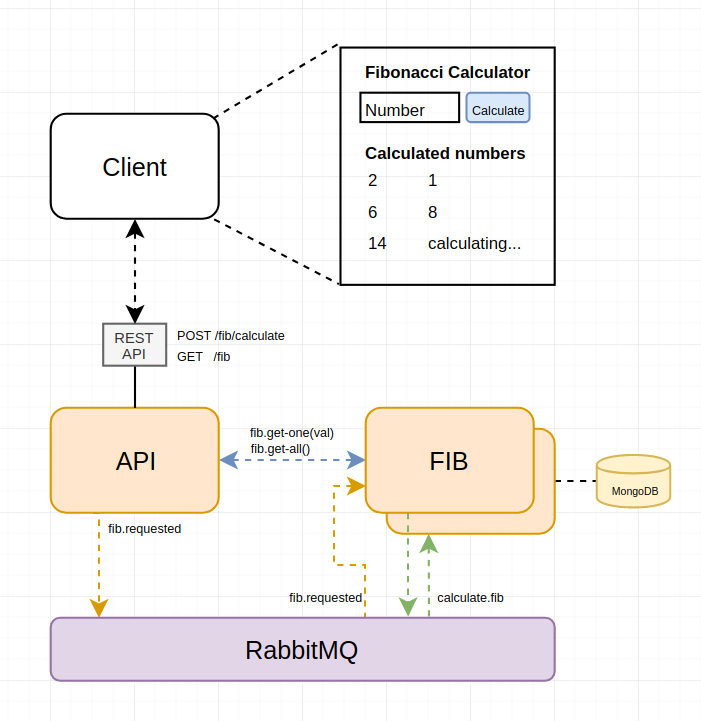

# Fibonacci Example

The most over complicated and inefficient fibonacci calculator of all time.



## Topics

- Simple Event-Driven Design
- Scalable Fibonacci service
- API service
- Use of light RPC's


## Infrastructure

We are going to require the following:
- RabbitMQ
- MongoDB

Create a `docker-compose.yml` file and copy the following (do not use this in production):

```yml
version: '2'
services:
  rabbitmq:
    image: 'rabbitmq:3.7-management-alpine'
    restart: always
    ports:
      - '15672:15672'
      - '5672:5672'
  mongo:
    image: 'bitnami/mongodb:latest'
    restart: always
    ports:
      - '27017:27017'
    environment:
      - MONGODB_USERNAME=fibonacci
      - MONGODB_PASSWORD=fibonacci
      - MONGODB_DATABASE=fibonacci
```
Finally start the service
```bash
$ docker-compose up -d
```

# Services
We are going to create two services:
- API (server)
- Fibonacci (worker)

## API service

To access our backend we are going to create a REST API to allow provide the needed endpoints for our client application.

For this we are going to create a service using **polymetis** which provides an easy way to create REST endopints.

```sh
mkdir api
cd api
npm init
```

Specify the entry point as `index.ts`.

Install all the dependecies for typescript, lodash(super useful) and **polymetis**
```sh
npm i -g ts-node typescript
npm i --save-dev @types/dotenv @types/lodash @types/node ts-node typescript
npm i --save dotenv lodash polymetis-node
```

Create an `.env` file with the configuration of the service
```sh
touch .env
```
```
ENVIRONMENT='local'
SERVICE='api'

# Logger mode
# ALL='0', DEBUG='1', INFO='2', WARN='3', ERROR='4', OFF='5'
LOGGER_MODE='0'

API_PORT='8000'
API_BASE_ROUTE='/api'

RABBITMQ_HOST='localhost'
RABBITMQ_PORT='5672'
RABBITMQ_USERNAME='guest'
RABBITMQ_PASSWORD='guest'
```

Next create an `index.ts` file and lets create our first polymetis service

```sh
touch index.ts
```

```typescript
import { ServiceBase } from 'polymetis-node';

const service = new ServiceBase();
service.init()
  .then(async () => {
    service.logger.info('Initialized...');
  })
  .catch((error) => {
    service.logger.error('Exiting:', error);
  });
```

Start the service
```sh
$ ts-node index.ts
[local::api] [...] [INFO] Rabbit connection initialized...
[local::api] [...] [INFO] Initialized...
```

Now we have the API service going lets define the endpoint we need for our app:
  - calculate: [POST] calculates the value fibonacci of a number.
  - get-all: [GET] return all calculated fibonacci numbers.

### REST Endpoints

To create endpoints we needs to create  `route.ts` files prefixed with [`get`, `post`, `put`, `delete`] inside an `api` directory.

So lets crate an `api` directory
```bash
mkdir api
cd api
touch post.calculate.route.ts
```

```typescript
import {
  Request,
  Response,
  ApiRoute,
  ServiceResources,
} from 'polymetis-node';
import * as _ from 'lodash';

export default class Route extends ApiRoute {
  public url: string = '/calculate';

  constructor(resources: ServiceResources) {
    super(resources);
  }

  public async callback(req: Request, res: Response): Promise<any> {
    this.resources.logger.debug('Calculating fibonacci');
    res.sendStatus(200);
  }
}
```

Once we start creating endoints in the ``api`` folder we have to explicily tell our service we want to initialize the `API routes`. This we do on the ``index.ts` by adding the following lines:

```typescript
import { ServiceBase } from 'polymetis-node';

const service = new ServiceBase();
service.init()
  .then(async () => {
    service.initAPI(); // Add to initialize API endpoints
    service.logger.info('Initialized...');
  })
  .catch((error) => {
    service.logger.error('Exiting:', error);
  });
```

Restart the service
```sh
$ ts-node index.ts
[local::api] [...] [INFO] Rabbit connection initialized...
[local::api] [...] [INFO] Loading API routes
[local::api] [...] [INFO] - POST /api/calculate
[local::api] [...] [INFO] Initialized...
[local::api] [...] [INFO] API initialized on port 8000
```

We can try our endpoint by doing a POST call to our API:

```sh
curl -i -X POST -d {} 'http://localhost:8000/api/calculate'

HTTP/1.1 200 OK
X-Powered-By: Express
Access-Control-Allow-Origin: *
Content-Type: text/plain; charset=utf-8
Content-Length: 2
ETag: W/"2-nOO9QiTIwXgNtWtBJezz8kv3SLc"
Date: Mon, 09 Dec 2019 10:14:28 GMT
Connection: keep-alive

OK
```

And in our service logs we should have something indicatng that the route ``/api/calculate`` was accesed via POST and returned a 200 response.

```sh
[local::api] [...] [INFO] POST /api/calculate
[local::api] [...] [INFO] POST /api/calculate 200
```

Nice. Now we should adecuate our endpoint yo receive a parameter via JSON. For this we have to prepare the ExpressJS app polymetis creates fo us in the service.

In the index lets add the following lines:

```typescript
import { ServiceBase, Configuration } from 'polymetis-node';
import express from 'express'; // import express

const configuration: Configuration = {
  baseDir: __dirname,
};
const service = new ServiceBase({ configuration });
service.init()
  .then(async () => {
    // Adding middlewares to the express app
    service.app.use(express.json()); // for parsing application/json
    service.app.use(express.urlencoded({ extended: true })); // for parsing application/x-www-form-urlencoded

    service.initAPI();
    service.logger.info('Initialized...');
  })
  .catch((error) => {
    service.logger.error('Exiting:', error);
  });
```

Now we can receive JSON in our routes with no pain.
In the ``/calculate`` endoint we expect to receive a number to calculate fib to. So lets get ne number from the request.

```typescript
import {
  Request,
  Response,
  ApiRoute,
  ServiceResources,
} from 'polymetis-node';
import * as _ from 'lodash'; // import lodash (super usefull)

export default class Route extends ApiRoute {
  public url: string = '/calculate';

  constructor(resources: ServiceResources) {
    super(resources);
  }

  public async callback(req: Request, res: Response): Promise<any> {
    const number: number = _.get(req.body, 'number', null); // safely get re.qbody.number or set as null if not defined

    // only integers
    if (!_.isInteger(number)) throw ('Invalid number');

    // Here goes our logic
    this.resources.logger.debug('Calculating fibonacci for', number);
    // Here goes our logic

    res.sendStatus(200);
  }
}
```

Lets try the endpoint sending the number ``3`` in the POST body

```sh
curl -i -X POST \
  -H "Content-Type:application/json" \
  -d \
  '{ "number": 3 }' \
  'http://localhost:8000/api/calculate'

HTTP/1.1 200 OK
X-Powered-By: Express
Access-Control-Allow-Origin: *
Content-Type: text/plain; charset=utf-8
Content-Length: 2
ETag: W/"2-nOO9QiTIwXgNtWtBJezz8kv3SLc"
Date: Mon, 09 Dec 2019 10:14:28 GMT
Connection: keep-alive

OK
```

Lets try the endpoint sending the string ``three`` in the POST body

```sh
curl -i -X POST \
  -H "Content-Type:application/json" \
  -d \
  '{ "number": "three" }' \
  'http://localhost:8000/api/calculate'

HTTP/1.1 400 Bad Request
X-Powered-By: Express
Access-Control-Allow-Origin: *
Content-Type: text/html; charset=utf-8
Content-Length: 14
ETag: W/"e-pnhP+EtbQDp6Pz++MC2MM4e/XfU"
Date: Mon, 09 Dec 2019 10:40:22 GMT
Connection: keep-alive

Invalid number
```

Nice! We have now our first endpoint of the API service. Now we need to create the worker service Fibonacci, that will take car of the ahrd work.

## Fibonacci service

To create the worker service lets repeat the steps for creating a service with polymetis.
In the root directory of the example, lets create a new folder `fibonacci` for the new service next to the api service.
```sh
mkdir fibonacci
cd fibonacci
npm init
```

Specify the entry point as `index.ts`.

Install all the dependecies. In this case we want to install also `mongoose` so we can access the mongo database.
```sh
npm i --save-dev @types/dotenv @types/lodash @types/mongoose @types/node ts-node typescript
npm i --save dotenv lodash mongoose polymetis-node
```

Create an `.env` file with the configuration of the service
```sh
touch .env
```
```
ENVIRONMENT='local'
SERVICE='fibonacci'

# Logger mode
# ALL='0', DEBUG='1', INFO='2', WARN='3', ERROR='4', OFF='5'
LOGGER_MODE='0'

RABBITMQ_HOST='localhost'
RABBITMQ_PORT='5672'
RABBITMQ_USERNAME='guest'
RABBITMQ_PASSWORD='guest'

MONGO_HOST='localhost'
MONGO_USERNAME='fibonacci'
MONGO_PASSWORD='fibonacci'
MONGO_DATABASE='fibonacci'
MONGO_PORT='27017'
```

Next create an `index.ts` file and lets create our first polymetis service

```sh
touch index.ts
```

```typescript
import { ServiceBase } from 'polymetis-node';

const service = new ServiceBase();
service.init()
  .then(async () => {
    service.logger.info('Initialized...');
  })
  .catch((error) => {
    service.logger.error('Exiting:', error);
  });
```

Start the service
```sh
$ ts-node index.ts
[local::fibonacci] [...] [INFO] Rabbit connection initialized...
[local::fibonacci] [...] [INFO] Initialized...
```

Nice! Now we have two services running. You can open tow consoles and run each service in each console.


