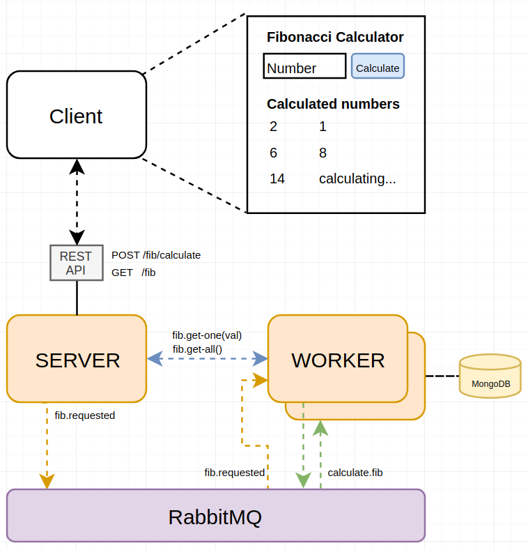

# Fibonacci Example

## Topics

- Simple Event-Driven Design
- Scalable Worker service
- Server service
- Use of light RPC's

In this example we will develop a very unrealistic and a little overcomplicated `fibonacci calculator`. But it will help understand the basic concepts of ``polymetis`` and how can we build loosely coupled and event-driven microservices with no pain.

The system consists of a web client (react) that will show an input where a user can ask for the Fibonacci value of any integer. The client will also list all the fibonacci values previously calculated.

In the backend, we will have a microservice event-driven architecture that will consist of two main services. First we will create an Service service that will allow the communication with the client. Second, we will create a worker service that will be responsible for calculating and storing the fibonacci calculations. The idea is to abstract all the heavy work to a service we can later scale (or auto scale) depending only on his own workload.

The Service service will receive the request for the Fibonacci value of a specific number, and it will emit an asynchronous event ``fib.requested`` returning nothing but a confirmation that the request was successfully received.

The worker node, will handle the ``fib.requested`` events and will perform the calculations storing them in a Mongo database.

To get the results the client will consume a GET endpoint wich will return all the calculated values. For this, the Service service will do a RPC to the Fibonacci service in order to get the already calculated values.

This example is not intended to do the Ultimate Fibonacci Calculator, but to show the use of the most important features of ``polymetis-node``.



## Getting started
Create a directory for our project and lets install typescript
```sh
mkdir fibonacci
cd fibonacci
npm i -g ts-node typescript
```

## Infrastructure

We are going to require the following:
- RabbitMQ
- MongoDB

Create a `docker-compose.yml` file and copy the following (do not use this in production):

```yml
version: '2'
services:
  rabbitmq:
    image: 'rabbitmq:3.7-management-alpine'
    restart: always
    ports:
      - '15672:15672'
      - '5672:5672'
  mongo:
    image: 'bitnami/mongodb:latest'
    restart: always
    ports:
      - '27017:27017'
    environment:
      - MONGODB_USERNAME=fibonacci
      - MONGODB_PASSWORD=fibonacci
      - MONGODB_DATABASE=fibonacci
```
Finally start the service
```bash
$ docker-compose up -d
```

# Backend
We are going to create two services:
- Server (api)
- Worker (fib calculator)

## Server service

To access our backend we are going to create a REST API to allow provide the needed endpoints for our client application.

For this we are going to create a service using **polymetis** which provides an easy way to create REST endopints.

```sh
mkdir server
cd server
npm init
```

Specify the entry point as `index.ts`.

Install all the dependecies for typescript, lodash(super useful) and **polymetis**
```sh
npm i --save-dev @types/dotenv @types/lodash @types/node ts-node typescript
npm i --save dotenv lodash polymetis-node
```

Create an `.env` file with the configuration of the service
```sh
touch .env
```
```
ENVIRONMENT='local'
SERVICE='server'

# Logger mode
# ALL='0', DEBUG='1', INFO='2', WARN='3', ERROR='4', OFF='5'
LOGGER_MODE='0'

API_PORT='8000'

RABBITMQ_HOST='localhost'
RABBITMQ_PORT='5672'
RABBITMQ_USERNAME='guest'
RABBITMQ_PASSWORD='guest'
```

Next create an `index.ts` file and lets create our first polymetis service

```sh
touch index.ts
```

```typescript
import { ServiceBase } from 'polymetis-node';

const service = new ServiceBase();
service.init()
  .then(async () => {
    service.logger.info('Initialized...');
  })
  .catch((error) => {
    service.logger.error('Exiting:', error);
  });
```

Start the service
```sh
$ ts-node index.ts
[local::server] [...] [INFO] Rabbit connection initialized...
[local::server] [...] [INFO] Initialized...
```

Now we have the Server going lets define the endpoints we need for our app:
  - calculate: `POST /fib/calculate` calculates the value fibonacci of a number.
  - get-all: `GET /fib` return all calculated fibonacci numbers.

**REST Endpoints**

To create endpoints we needs to create `route.ts` files prefixed with [`get`, `post`, `put`, `delete`] inside an `api` directory.

So lets crate an `api` directory
```bash
mkdir api
cd api
touch post.calculate.route.ts
```

```typescript
import {
  Request,
  Response,
  ApiRoute,
  ServiceResources,
} from 'polymetis-node';
import * as _ from 'lodash';

export default class Route extends ApiRoute {
  public url: string = '/fib/calculate';

  constructor(resources: ServiceResources) {
    super(resources);
  }

  public async callback(req: Request, res: Response): Promise<any> {
    this.resources.logger.debug('Calculating fibonacci');
    res.sendStatus(200);
  }
}
```

Once we start creating endoints in the ``api`` folder we have to explicily tell the service we want to initialize the `API routes`. This we do on the ``index.ts` by adding the following lines:

```typescript
import { ServiceBase } from 'polymetis-node';

const service = new ServiceBase();
service.init()
  .then(async () => {
    await service.initAPI(); // Add to initialize API endpoints
    service.logger.info('Initialized...');
  })
  .catch((error) => {
    service.logger.error('Exiting:', error);
  });
```

Restart the service
```sh
$ ts-node index.ts
[local::server] [...] [INFO] Rabbit connection initialized...
[local::server] [...] [INFO] Loading API routes
[local::server] [...] [INFO] - POST /fib/calculate
[local::server] [...] [INFO] API initialized on port 8000
[local::server] [...] [INFO] Initialized...
```

We can try our endpoint by doing a POST call to our API:

```sh
curl -i -X POST -d {} 'http://localhost:8000/fib/calculate'

HTTP/1.1 200 OK
X-Powered-By: Express
Access-Control-Allow-Origin: *
Content-Type: text/plain; charset=utf-8
Content-Length: 2
ETag: W/"2-nOO9QiTIwXgNtWtBJezz8kv3SLc"
Date: Mon, 09 Dec 2019 10:14:28 GMT
Connection: keep-alive

OK
```

And in the service logs we should have something indicatng that the route `fib/calculate` was accesed via POST and returned a 200 response.

```sh
[local::server] [...] [INFO] POST /fib/calculate
[local::server] [...] [INFO] POST /fib/calculate 200
```

Now lets prepare the endpoint yo receive a parameter via JSON. For this we have to prepare the ExpressJS app polymetis creates fo us in the service.

In the ``index.ts`` lets add the following lines:

```typescript
import { ServiceBase, Configuration } from 'polymetis-node';
import express from 'express'; // import express

const configuration: Configuration = {
  baseDir: __dirname,
};
const service = new ServiceBase({ configuration });
service.init()
  .then(async () => {
    // Adding middlewares to the express app
    service.app.use(express.json()); // for parsing application/json
    service.app.use(express.urlencoded({ extended: true })); // for parsing application/x-www-form-urlencoded

    service.initAPI();
    service.logger.info('Initialized...');
  })
  .catch((error) => {
    service.logger.error('Exiting:', error);
  });
```

Now we can receive JSON in our routes with no pain.
In the ``/calculate`` endoint we expect to receive a number to calculate fib to. So lets get ne number from the request.

```typescript
import {
  Request,
  Response,
  ApiRoute,
  ServiceResources,
} from 'polymetis-node';
import * as _ from 'lodash'; // import lodash (super usefull)

export default class Route extends ApiRoute {
  public url: string = '/fib/calculate';

  constructor(resources: ServiceResources) {
    super(resources);
  }

  public async callback(req: Request, res: Response): Promise<any> {
    const number: number = _.get(req.body, 'number', null); // safely get re.qbody.number or set as null if not defined

    // only integers
    if (!_.isInteger(number)) throw ('Invalid number');

    // Here goes our logic
    this.resources.logger.debug('Calculating fibonacci for', number);
    // Here goes our logic

    res.sendStatus(200);
  }
}
```

Lets try the endpoint sending the number `3` in the POST body

```sh
curl -i -X POST \
  -H "Content-Type:application/json" \
  -d \
  '{ "number": 3 }' \
  'http://localhost:8000/fib/calculate'

HTTP/1.1 200 OK
X-Powered-By: Express
Access-Control-Allow-Origin: *
Content-Type: text/plain; charset=utf-8
Content-Length: 2
ETag: W/"2-nOO9QiTIwXgNtWtBJezz8kv3SLc"
Date: Mon, 09 Dec 2019 10:14:28 GMT
Connection: keep-alive

OK
```

Lets try the endpoint sending the string ``three`` in the POST body

```sh
curl -i -X POST \
  -H "Content-Type:application/json" \
  -d \
  '{ "number": "three" }' \
  'http://localhost:8000/fib/calculate'

HTTP/1.1 400 Bad Request
X-Powered-By: Express
Access-Control-Allow-Origin: *
Content-Type: text/html; charset=utf-8
Content-Length: 14
ETag: W/"e-pnhP+EtbQDp6Pz++MC2MM4e/XfU"
Date: Mon, 09 Dec 2019 10:40:22 GMT
Connection: keep-alive

Invalid number
```

Nice! We have now the first endpoint of the Service service. Lets create the ``GET /fib/`` endpoint to retrive all calculated fibonacci numbers.

So lets crate the new route `get.all.route.ts` inside the `api` folder
```bash
touch get.all.route.ts
```

```typescript
import {
  Request,
  Response,
  ApiRoute,
  ServiceResources,
} from 'polymetis-node';
import * as _ from 'lodash';

export default class Route extends ApiRoute {
  public url: string = '/';

  constructor(resources: ServiceResources) {
    super(resources);
  }

  public async callback(req: Request, res: Response): Promise<any> {
    // Here goes our logic
    this.resources.logger.debug('Getting all calculated fibonacci numbers');
    // Here goes our logic

    res.send([]);
  }
}
```


Now we need to create the worker service Fibonacci, that will take car of the ahrd work.

## Fibonacci service

To create the worker service lets repeat the steps for creating a service with polymetis.
In the root directory of the example, lets create a new folder `worker` for the new service next to the api service.
```sh
mkdir worker
cd worker
npm init
```

Specify the entry point as `index.ts`.

Install all the dependecies. In this case we want to install also `mongoose` so we can access the mongo database.
```sh
npm i --save-dev @types/dotenv @types/lodash @types/mongoose @types/node ts-node typescript
npm i --save dotenv lodash mongoose polymetis-node
```

Create an `.env` file with the configuration of the service
```sh
touch .env
```
```
ENVIRONMENT='local'
SERVICE='worker'

# Logger mode
# ALL='0', DEBUG='1', INFO='2', WARN='3', ERROR='4', OFF='5'
LOGGER_MODE='0'

RABBITMQ_HOST='localhost'
RABBITMQ_PORT='5672'
RABBITMQ_USERNAME='guest'
RABBITMQ_PASSWORD='guest'

MONGO_HOST='localhost'
MONGO_USERNAME='fibonacci'
MONGO_PASSWORD='fibonacci'
MONGO_DATABASE='fibonacci'
MONGO_PORT='27017'
```

Next create an `index.ts` file and lets create the worker service

```sh
touch index.ts
```

```typescript
import { ServiceBase, Configuration } from 'polymetis-node';

// Initializing service
const configuration: Configuration = {
  baseDir: __dirname,
};
const service = new ServiceBase({ configuration });
service.init()
  .then(async () => {
    service.logger.info('Initialized...');
  })
  .catch((error) => {
    service.logger.error('Exiting:', error);
  });
```

Start the service
```sh
$ ts-node index.ts
[local::worker] [...] [INFO] Rabbit connection initialized...
[local::worker] [...] [INFO] Initialized...
```

Nice! Now we have two services running. You can open two consoles and run each service in each console.

## RPC's

Polymetis provides a very easy way to declare synchronus remote procedures that can be call between services. We will need to define a couple procedures in the `Worker` that the `Server` is going to call.
- fib-get-one(number)
- fib-get-all()

All RPC definitions have to be inside a folder named `rpc` and files must have the extension `rpc.ts` in the defined index of the service. So lets create the following directory `worker/rpc`
```bash
mkdir rpc
cd rpc
touch get-one.rpc.ts
touch get-all.rpc.ts
```

```typescript
// get-one.rpc.ts
import * as _ from 'lodash';
import { ServiceResources, RPCHandlerBase } from 'polymetis-node';

export default class Handler extends RPCHandlerBase {
  // Name of the procedure that will be use to call it from other services
  public topic = 'fib-get-one';

  constructor(resources: ServiceResources) {
    super(resources);
  }

  // RPC main functions
  // here it will return a number if it is in the database
  // or null if it isnt calculated yet
  protected async handleCallback(data: any): Promise<number | null> {
    this.resources.logger.debug('Executing fib-get-one RPC', data);

    return null;
  }
}
```

```typescript
// get-all.rpc.ts
import * as _ from 'lodash';
import { ServiceResources, RPCHandlerBase } from 'polymetis-node';

export default class Handler extends RPCHandlerBase {
  // Name of the procedure that will be use to call it from other services
  public topic = 'fib-get-all';

  constructor(resources: ServiceResources) {
    super(resources);
  }

  // RPC main functions
  // here it will return all numbers calculated in the database
  protected async handleCallback(data: any): Promise<any[]> {
    this.resources.logger.debug('Executing fib-get-one RPC', data);

    return [];
  }
}
```

In the ``index.ts`` lets add the following lines:

```typescript
import { ServiceBase, Configuration } from 'polymetis-node';

// Initializing service
const configuration: Configuration = {
  baseDir: __dirname,
};
const service = new ServiceBase({ configuration });
service.init()
  .then(async () => {
    await service.initRPCs(); // Add this to initialize the RPC's
    service.logger.info('Initialized...');
  })
  .catch((error) => {
    service.logger.error('Exiting:', error);
  });
```

Restart the service
```sh
$ ts-node index.ts
[local::worker] [...] [INFO] Rabbit connection initialized...
[local::worker] [...] [INFO] Loading RPCs
[local::worker] [...] [INFO] - fib-get-all
[local::worker] [...] [INFO] - fib-get-one
[local::worker] [...] [INFO] RPCs initialized
[local::worker] [...] [INFO] Initialized...
```

### Calling the procedure

Now we defined the RPC's is time to actually call them from the server.

In the endoint `GET /fib` we need to call the `fib-get-all` procedure that we just defined. In the `server/api/get.all.route.ts` file lets add the following:

```typescript
import {
  Request,
  Response,
  ApiRoute,
  ServiceResources,
} from 'polymetis-node';
import * as _ from 'lodash';

export default class Route extends ApiRoute {
  public url: string = '/fib';

  constructor(resources: ServiceResources) {
    super(resources);
  }

  public async callback(req: Request, res: Response): Promise<any> {
    // Calling rpc fib-get-all in service worker
    // this.callRPC method comes with the ApiRoute class from polymetis
    // It receives as the first argument the name of the service where the RCP is defiend.
    // It receives as the second argument the name of the RCP topic defined.
    // It receives as the third argument the payload that the procedure will receive.
    // The async call returns a status and an error or the response data we receive from the procedure.
    const { status, data, error } = await this.callRPC('worker', 'fib-get-all', {});
    if (status === 'error') {
      this.resources.logger.error(error);
      return res.status(400).send(error);
    }
    if (status === 'timeout') {
      this.resources.logger.error(error);
      return res.status(500).send('timeout');
    }
    const retval: any[] = data;

    res.send(retval);
  }
}
```